# Experiment Log

All experiments replicate / extend Bhalla et al. "Do Sparse Autoencoders Capture Concept Manifolds?" (arXiv:2604.28119) using **Gemma 3 12B** activations (layer 24) and **GemmaScope 2 JumpReLU SAE** (16k width, medium L0≈44.7).

---

## 1. Colors manifold — initial PCA (hex encoding)

Harvested last-token activations for prompts `"The hex code #rrggbb is for the color"` across 5832 colors; 4 spurious clusters appeared in PCA projections, traced to BPE tokenizer producing 4–7 tokens for `#rrggbb`.

- **Script:** `run_gemma_pca.py`
- **Data:** `figures/gemma_pca/activations_colors.pt`
- **Figures:** `figures/gemma_pca/pca_colors.png` · `pca_colors_higher.png` (axes 123/234/345/456) · `pca_colors_multiview.png`

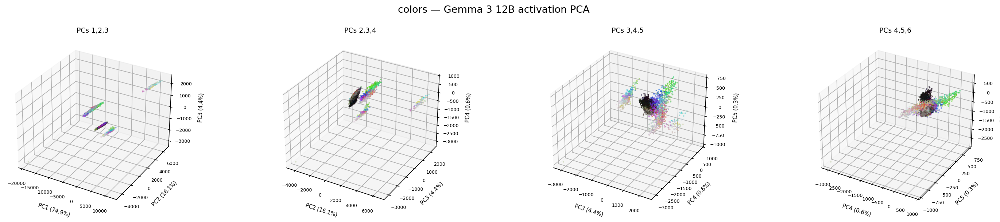

---

## 2. Hex tokenization artifact analysis

Showed that Gemma BPE tokenizes `#rrggbb` into 4–7 tokens depending on byte values; each k-means cluster is 100% pure in token count, explaining the discrete clusters.

- **Script:** `run_gemma_pca.py` (hex distribution section)
- **Figure:** `figures/gemma_pca/color_hex_distribution.png` · `pca_colors_kmeans4.png`

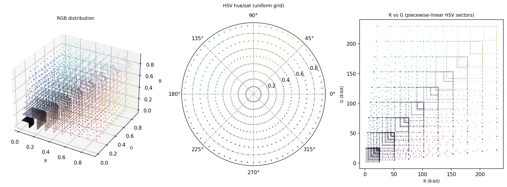

---

## 3. Color encoding comparison — zero-padded RGB fixes clusters

Tested four formats (original hex, zero-padded RGB, HSL, natural-language HSV); zero-padded `rgb(rrr,ggg,bbb)` always tokenizes to exactly 17 tokens, producing a smooth continuous manifold.

- **Script:** `run_gemma_pca.py` (encoding variants)
- **Data:** `figures/gemma_pca/activations_colors_rgb.pt` · `_hsl.pt` · `_nlhsv.pt`
- **Figure:** `figures/gemma_pca/pca_colors_all_encodings.png` · `pca_colors_hex_vs_rgb.png`

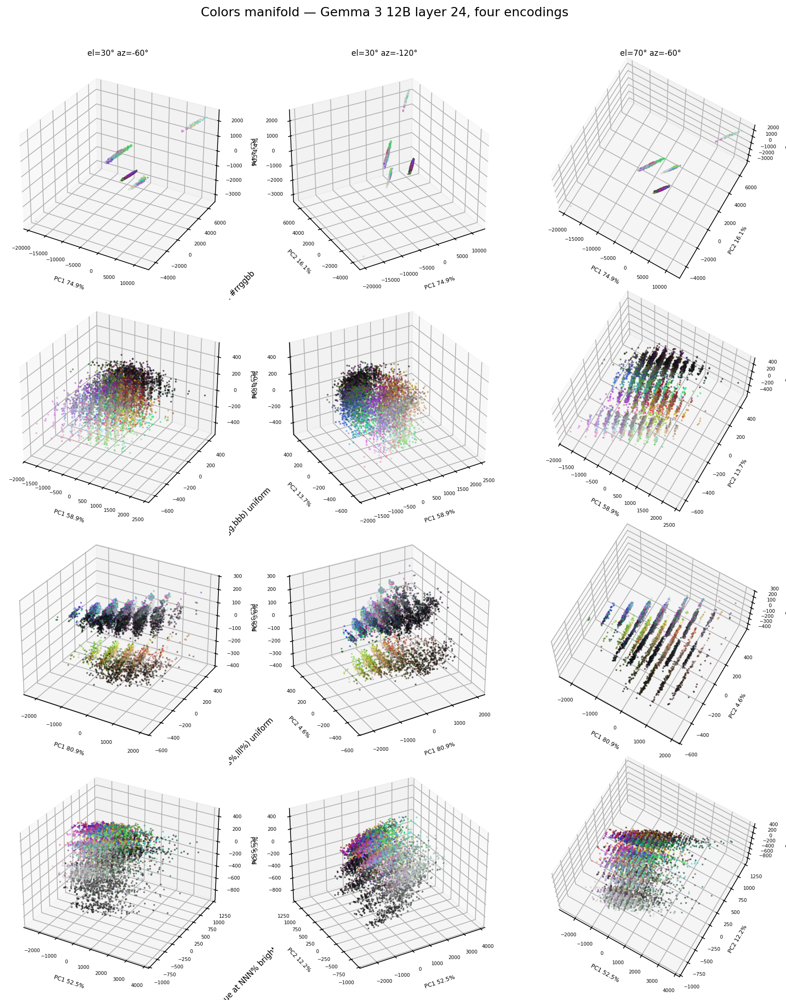

---

## 4. Colors manifold — layer sweep (12 / 24 / 36 / 42)

Repeated zero-padded RGB experiment across four layers; layer 42 shows the most evenly distributed PCA variance (25.8 / 19.5 / 16.2%) and clearest hue-wrapping curvature.

- **Script:** `run_gemma_pca.py --layer {12,36,42}`
- **Data:** `figures/gemma_pca/activations_colors_rgb_layer{12,36,42}.pt`
- **Figure:** `figures/gemma_pca/pca_colors_rgb_layers.png`

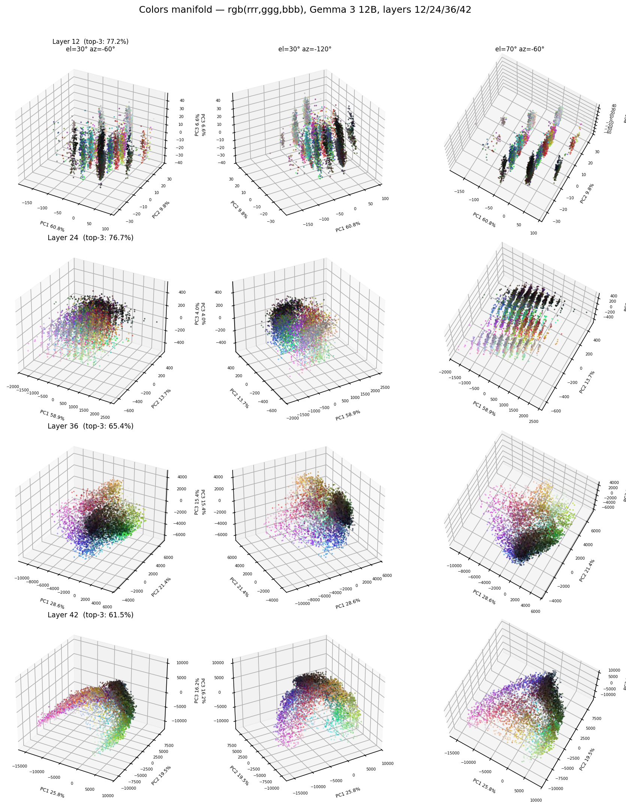

---

## 5. Years manifold — paper prompt vs. month-injected

Paper uses `"The date is {year}"` (helix in Llama); our prompt `"The date is {month} {year}"` injects the helix structure via months since Gemma doesn't spontaneously encode it.

- **Script:** `gen_years_paper.py`
- **Data:** `figures/gemma_pca/activations_years_paper.pt` · `activations_years.pt`
- **Figure:** `figures/gemma_pca/pca_years_comparison.png`

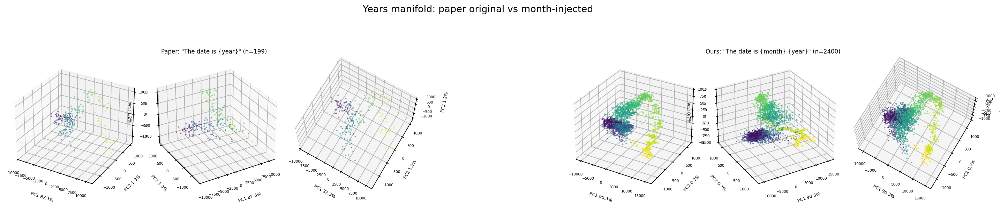

---

## 6. GemmaScope SAE — restricted R² (16k, max 32 atoms)

Greedy atom selection by label-correlation; OLS in concept subspace; non-monotonic curves visible for all 4 manifolds (colors/days/temperature/years).

- **Script:** `run_gemma_eval.py --sae-width 16k`
- **Eval code:** `nonlinear_features/evaluate_real.py`
- **Summary:** `figures/gemma_eval/eval_summary_16k.json`
- **Figure:** `figures/gemma_eval/restricted_r2_16k.png`

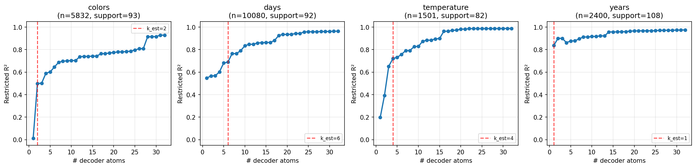

---

## 7. GemmaScope SAE — multi-n restricted R² (n = 16 / 32 / 64 / 128 atoms)

Sweeps atom pool size n; curves collapse for k ≤ min(n) since top-k atoms by correlation are identical across pool sizes — shows n doesn't affect early R² but maximum R² grows with larger pools.

- **Script:** `run_gemma_eval.py --multi-n 16,32,64,128`
- **Figure:** `figures/gemma_eval/restricted_r2_multi_n_16k.png`

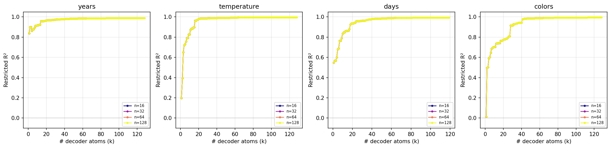

---

## 8. GemmaScope SAE — Ising coupling (16k, concept-atom restricted)

Fixed from 256 atoms (all active across 11 accidentally loaded files) to 104 atoms (union of per-manifold greedy selections); concept assignments balanced: years=25, colors=30, temperature=25, days=24.

- **Script:** `run_gemma_eval.py` (Ising section)
- **Figure:** `figures/gemma_eval/ising_coupling_16k.png`

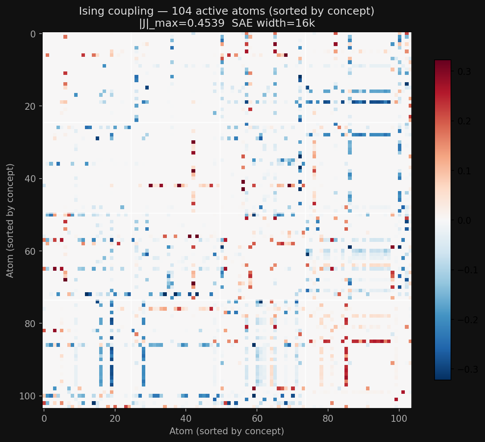

---

## 9. GemmaScope SAE — Figure 4B (real manifolds, post-hoc K sweep)

Post-hoc top-K thresholding on JumpReLU codes; colors manifold has distinctly lower RF spread (~0.57–0.78) vs 1D manifolds (~0.9–1.0), consistent with its 2D hue/saturation structure.

- **Script:** `run_gemma_eval.py --k-values 5,10,15,20,30,45,60,80`
- **Figure:** `figures/gemma_eval/figure4b_16k.png`

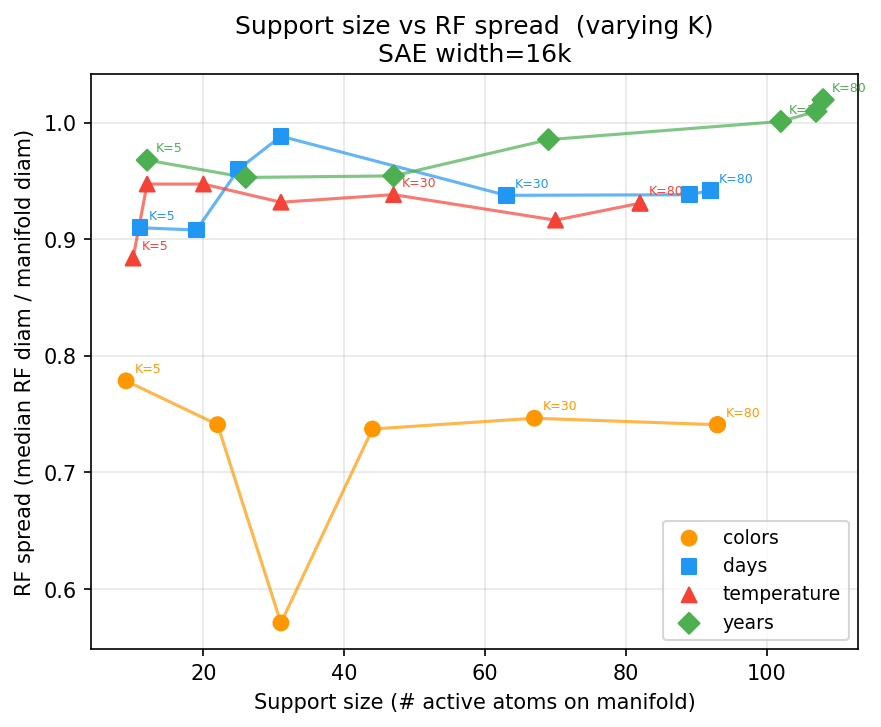

---

## 10. Synthetic Figure 4B (L1 SAE, 8 manifold types × 6 variants)

Support size vs RF spread path as SAE sparsity k varies (k=3→25); all 8 manifold types show the expected L-shape — small k → small support + narrow RF, large k → large support + wide RF.

- **Script:** `run_synthetic.py --loss-fn l1` (prior run)
- **Data:** `checkpoints_l1/results.json`
- **Plot script:** `plot_synthetic_fig4.py`
- **Figure:** `figures/synthetic/fig4b_support_rf.png`

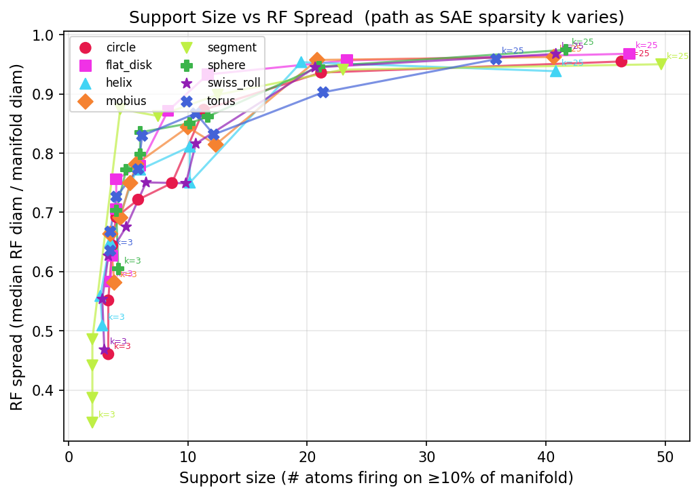

---

## 11. Synthetic MSE run — Figure 4A, 4B, 4C (corrected to match paper)

Re-trained k=[3,4,6,8,10,14,16,20,25] with MSE loss; R² evaluated for 1–50 atoms. Figure 4A left shows aggregate R²@k_i vs K (peaks k≈14 with MSE; k≈4 with L1 as in paper). Figure 4A right shows per-type R²(atoms) curves at five K values. Figure 4B is a single averaged path through (support_size, RF_spread). Figure 4C (Ising) run at k=4 capture sweet-spot and sorted by ground-truth manifold assignment — reveals clean block-diagonal structure.

- **Script:** `run_synthetic.py --loss-fn mse --abs-max-atoms 50` · `run_synthetic_ising.py --k 4`
- **Data:** `checkpoints_mse/results.json` · `checkpoints_mse/sae_k*.pt`
- **Plot script:** `plot_synthetic_fig4.py checkpoints_mse/results.json`
- **Figures:** `figures/synthetic/fig4a.png` · `figures/synthetic/fig4b.png` · `figures/synthetic/ising_coupling_k4.png`

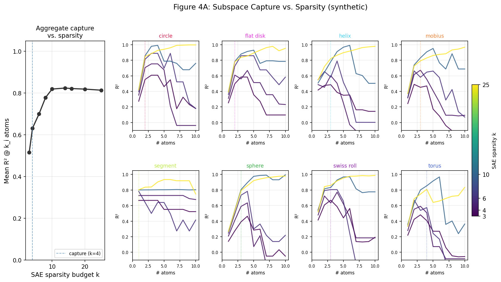

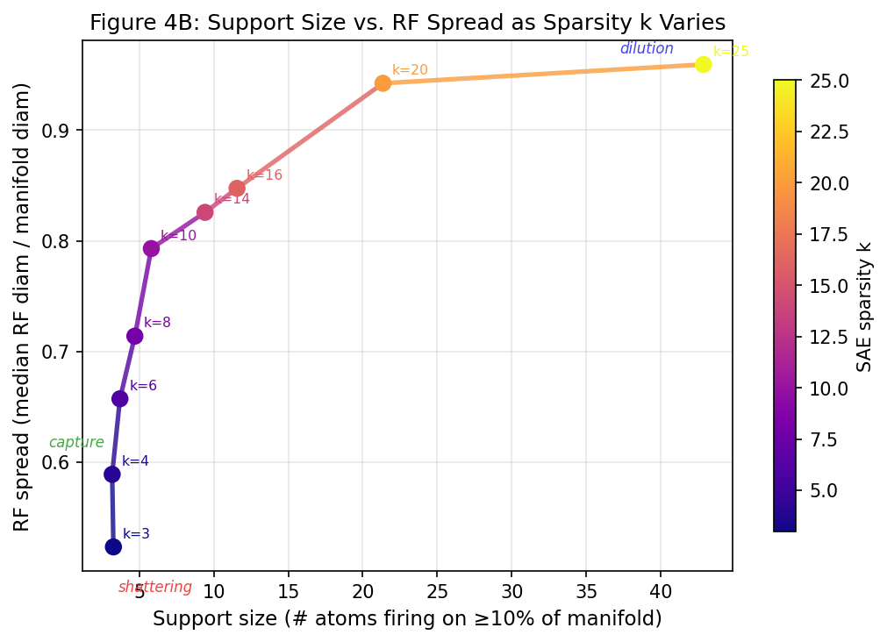

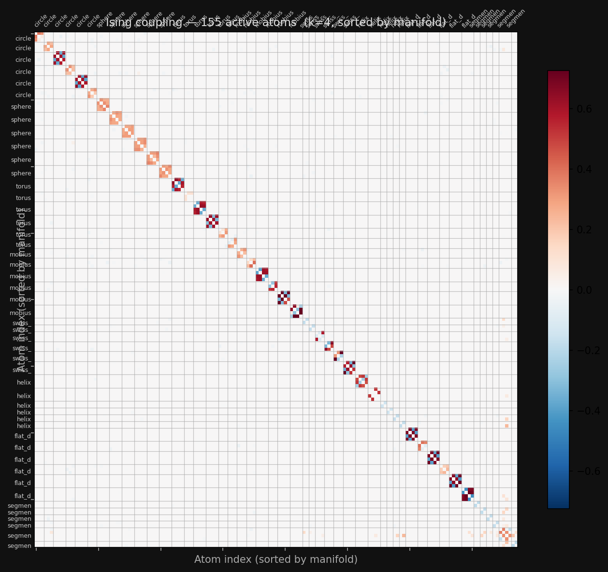

---

---

# Gemma Line-Breaking Experiments

## Behavioral Evals
`run_gemma_linebreak_eval.py` · results: `figures/linebreak_eval_v2/linebreak_eval_results.json`

- Ran generation and logit-probe evals for Gemma 3 12B and 27B on the fixed-width line-breaking task; both models show "trigger-happy" newline behavior with p(newline) 3–424× higher than p(next word) mid-line, and nl_margin ramps sharply at 75–85% of target width.

## SAE Contrastive Analysis
`run_gemma_linebreak_mech.py` · figures: `figures/linebreak_mech/sae_contrastive.html`, `sae_feature_*.html` · data: `figures/linebreak_mech/mech_summary.json`

- Compared resid_post L24 SAE features at the same char_pos under width=40 (near-break) vs width=80 (mid-line); found F14066 as a binary near-break detector (mean_40=337, mean_80=0) and F885 as the largest-delta feature overall.

## SAE PCA + Control
`run_gemma_linebreak_mech.py` · figures: `figures/linebreak_mech/sae_pca_remaining.html`, `sae_control_profiles.html`

- Projected all (text, width, char_pos) SAE activations into 3D PCA space (PC1=44.6%) and ran the same analysis on repeated "ab " control tokens to isolate position signal from content.

## Layer Probe (corrected)
`run_layer_probe_fine.py`, `run_gemma_linebreak_mech.py` · data: `figures/linebreak_mech/layer_probe_fine.json`, `layer_probe_full_shuffled.json`

- Probed char_pos linear decodability from each layer's residual stream using control sequences and shuffled CV (fixing a fold-ordering bug that produced spurious negative R²); found R²>0.97 from layer 1 onward, declining gradually from layer 21 to ~0.73 at the final layer.

## Attn vs MLP Decomposition
`run_layer_probe_fine.py` · data: `figures/linebreak_mech/layer_probe_attn_out.json`, `layer_probe_mlp_out.json`

- Hooked `post_attention_layernorm` and `post_feedforward_layernorm` at layers 0–6; attention is the primary position writer (R²=0.856 at L0, jumping to 0.995 at L1), with MLP lagging slightly and catching up by layer 5.

## PCA Per-Axis R² and Embedding Baseline
`run_pca_viz.py` · figures: `figures/linebreak_mech/pca_top3_attn_out_L{0,1}.html` · data: `figures/linebreak_mech/pca_viz_summary.json`

- Confirmed raw token embeddings have R²=0.000 with char_pos (RoPE adds no position to embeddings); at L0 attn PC1 is the position axis (R²=0.54), at L1 attn position migrates to PC3 (R²=0.67) while PC1 captures width-context (R²=0.10).

## PCA Trajectory Geometry
`run_pca_trajectory.py` · figures: `figures/linebreak_mech/attn_trajectory_L{0,1}_{2d,3d,scree}.html`

- Visualised how attn_out moves through activation space as char_pos varies; both L0 and L1 are ~2D (PC1+PC2 ≈ 95–96%), with L0's PC1 being the position direction and L1's PC1 being a width-discriminating direction.

## Attn SAE Position Features
`run_attn_sae_position.py` · figures: `figures/linebreak_mech/attn_sae_*_profiles.html`, `attn_sae_L{0,1}_r2_bar.html` · data: `figures/linebreak_mech/attn_sae_position_summary.json`

- Loaded GemmaScope `attn_out_all` 16k-small SAEs for L0 and L1 (hook at `o_proj.input`); L0 best feature F299 r²=0.56, L1 best feature F632 r=+0.905 r²=0.82 with char_pos — a very clean monotone position-ramp feature.

## Ising Coactivation Matrices
`run_linebreak_ising.py` · figures: `figures/linebreak_mech/ising_linebreak_{attn_L0,attn_L1,resid_L24}.png` · data: `figures/linebreak_mech/ising_linebreak_summary.json`

- Fit pairwise Ising models on prose-text SAE codes for attn_out L0/L1 and resid_post L24 (825 samples each); concept labeling was sparse because content noise swamps position signal at R_THRESH=0.35 — needs re-run with control sequences or a lower threshold.
