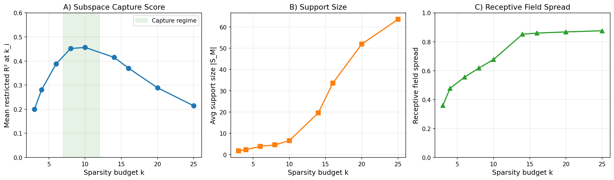
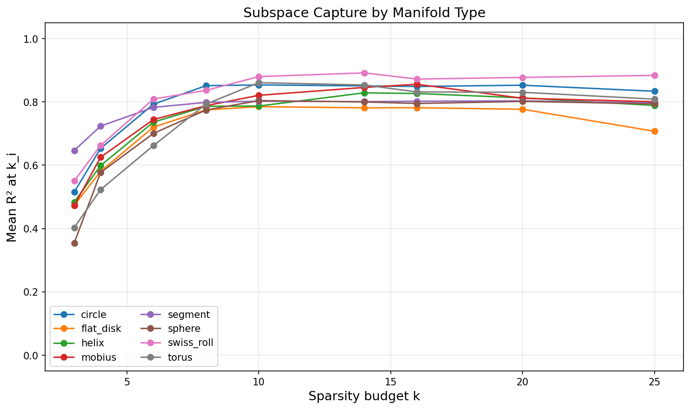
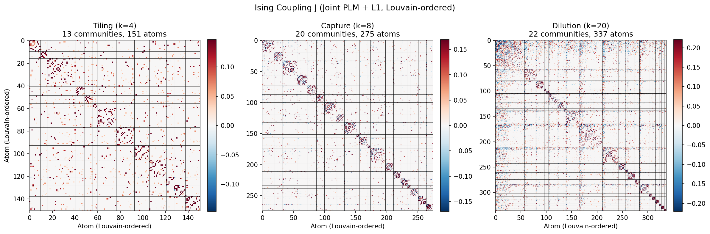
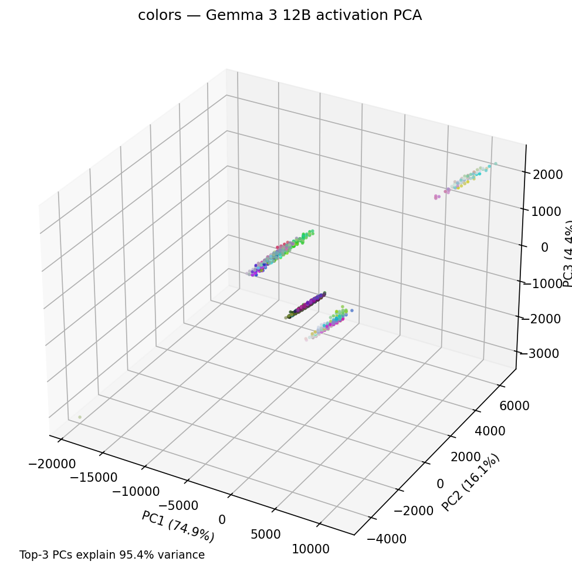
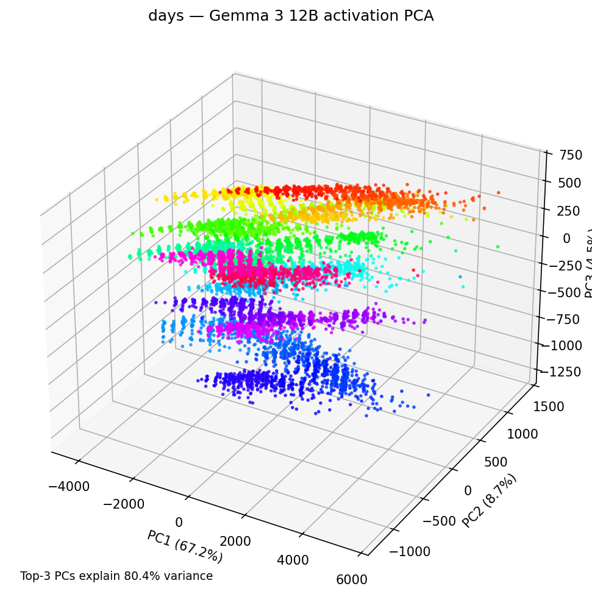
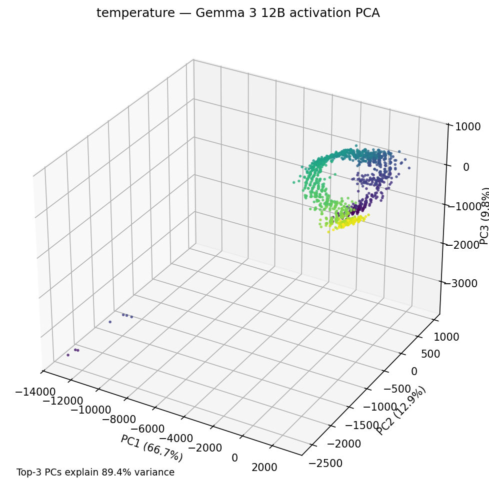
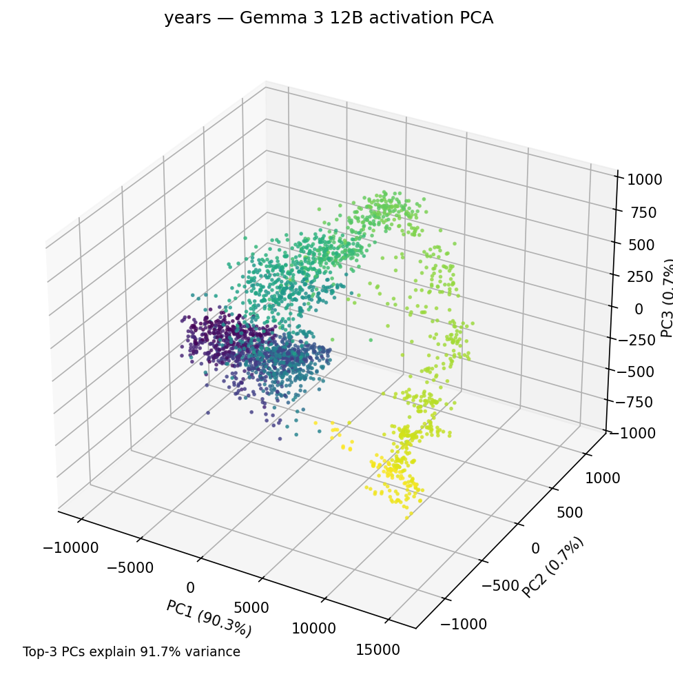
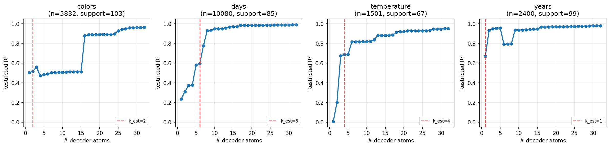
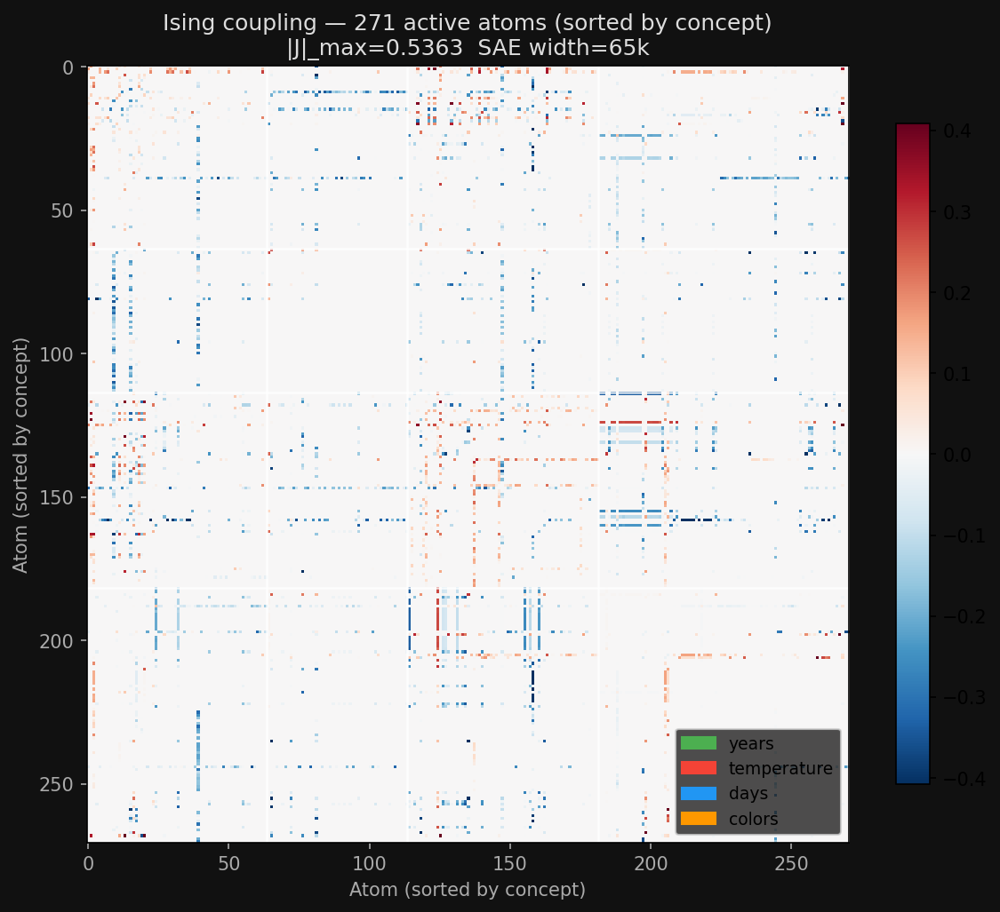

# Do Sparse Autoencoders Capture Concept Manifolds? — A Replication and Extension

## Hook / Motivation

- The Linear Representation Hypothesis (LRH) assumes concepts = directions in activation space. But growing evidence shows many concepts (color, time, temperature) are organized along *curved, low-dimensional manifolds*.
- This paper (Bhalla, Fel, Rager et al., arXiv:2604.28119) asks: if the geometry is nonlinear, can SAEs still recover it? Answer: yes, but only through *groups* of atoms that collectively tile the manifold — never through individual features.
- We replicate their synthetic experiment from scratch and extend it to Gemma 3 12B with GemmaScope 2 SAEs to test whether the same manifold structure appears in a different model family.

---

## Part 1: Background — Manifold Superposition and How SAEs Handle It

- Key idea: representations are *additive mixtures of manifold samples*, not just superposed directions.
  - Data model: $x = \sum_{i \in S} \tilde\gamma_i(\theta_i) V_i + \epsilon$, where each $\gamma_i$ is a point on a manifold, $V_i$ is its embedding matrix, $|S|$ is the number of active manifolds per sample.
- SAEs can capture manifolds in two ways:
  - **Globally**: a compact group of atoms whose linear span contains the entire manifold
  - **Locally (tiling)**: atoms that each selectively tile a restricted region of the geometry
- Three regimes as sparsity budget $k$ increases:
  1. **Tiling/Shattering** (low $k$): atoms are shared across manifolds, no clean block structure
  2. **Capture** (intermediate $k$): atoms cleanly span individual manifold subspaces
  3. **Dilution** (high $k$): atoms over-tile manifolds redundantly, fragmenting structure
- The Ising model formalism: fit a pairwise Markov random field (±1 spins) to SAE atom co-firing patterns. Block-diagonal structure in the coupling matrix $J$ reveals manifold communities.

---

## Part 2: Synthetic Experiment — Setup

- 48 manifold instances: 8 types (circles, spheres, tori, Mobius strips, Swiss rolls, helices, flat disks, line segments) × 6 variants each
- Ambient dimension $d=128$, dictionary size $c=512$ (4× expansion)
- 2M training samples, 100k eval samples, $L_0=4$ manifolds active per sample
- TopK SAE architecture with sparsity sweep: $k \in \{3, 4, 6, 8, 10, 14, 16, 20, 25\}$
- Training: Adam (lr=3e-3), L1 reconstruction loss, cosine LR schedule, auxiliary dead-neuron loss

---

## Part 3: Synthetic Results — The Three Regimes

### Main result figure

Peak restricted R² = 0.83 at $k=14$, with clear tiling→capture→dilution transition. Support size grows exponentially with $k$ while receptive field spread saturates near 1.0 in the dilution regime.

### Per-manifold breakdown

All 8 manifold types follow the same qualitative curve. Segments and Swiss rolls are captured most easily (1D, high curvature → clean tiling), while spheres and tori are hardest (higher intrinsic dimension).

### Ising coupling matrices

- **k=4 (tiling)**: sparse, noisy coupling — atoms shared across manifolds, 13 Louvain communities
- **k=8 (capture)**: clean block-diagonal structure emerges — atoms cluster by manifold, both positive (co-firing) and negative (mutually exclusive) couplings visible
- **k=20 (dilution)**: blocks fragment — 22 communities, redundant tiling breaks clean structure

### Final results table

| k | R² | VE | Dead neurons | Regime |
|---|---|---|---|---|
| 3 | 0.49 | 0.74 | 12 | Tiling |
| 4 | 0.62 | 0.83 | 4 | Tiling |
| 6 | 0.74 | 0.94 | 5 | Transition |
| 8 | 0.80 | 0.98 | 1 | Capture |
| 10 | 0.82 | 0.99 | 1 | Capture |
| **14** | **0.83** | **0.99** | **3** | **Peak** |
| 16 | 0.83 | 1.00 | 2 | Dilution onset |
| 20 | 0.82 | 1.00 | 0 | Dilution |
| 25 | 0.79 | 1.00 | 0 | Dilution |

Our peak R² (0.83) is somewhat below the paper's reported ~0.9. The residual gap is likely due to: (a) the paper may use $c=1024$ vs. our $c=512$, (b) possible differences in training duration/hyperparameters not fully specified, (c) VE still below the paper's 0.85 quality threshold at low $k$ values.

---

## Part 4: Extension to Gemma 3 12B — Do Real Model Activations Show Manifold Structure?

### Step 1: Activation Harvesting and PCA Verification

We harvest last-token activations from Gemma 3 12B Instruct at layer 24 (~60% depth) for four concept manifolds identified in the paper's Llama 3.1 8B analysis:

| Concept | Prompt template | Expected geometry | PCA variance (top 3) |
|---|---|---|---|
| Colors | "The hex code {h} is for the color" | Paraboloid | 95.4% |
| Days | "It's {time} on {day}" | Circle | 80.4% |
| Temperature | "Today it's {f} degrees Fahrenheit outside" | Line | 89.4% |
| Years | "The date is year {y}" | Helix | 91.7% |

#### PCA visualizations

| | |
|---|---|
|  |  |
| Colors — elongated paraboloid structure in 3D | Days — circular/periodic structure visible |
|  |  |
| Temperature — clustered linear structure | Years — helical/segmented progression |

Key finding: the same manifold geometries documented in Llama 3.1 8B appear in Gemma 3 12B, confirming these are general properties of transformer representations, not model-specific artifacts.

### Step 2: GemmaScope SAE Evaluation

We evaluate pre-trained GemmaScope 2 JumpReLU SAEs (not TopK) at two widths: 16k and 65k latents.

#### Restricted R² — 65k SAE

The 65k SAE achieves R² > 0.93 on all four manifolds at 32 atoms. Notable features:
- **Colors** shows a dramatic jump from ~0.51 to ~0.88 at 16 atoms (the SAE finds a compact basis after threshold)
- **Days** reaches 0.93 by just 8 atoms (circle is low-dimensional, easy to span)
- **Years** hits 0.93 at only 2 atoms (helix well-captured by a small atom group)

#### Restricted R² — 16k SAE

The narrower 16k SAE shows much more oscillatory R² curves — adding atoms sometimes *decreases* R² (negative interference from atoms that point away from the concept subspace). Peak R² at 32 atoms: colors 0.92, days 0.96, temperature 0.99, years 0.97.

#### Ising coupling — 65k SAE

271 active atoms sorted by concept assignment. Block-diagonal structure is visible but noisier than the synthetic case — expected since real model SAEs encode many more overlapping concepts.

Concept assignments: colors (89 atoms), days (68), years (64), temperature (50).

#### Ising coupling — 16k SAE

256 active atoms, $|J|_{max} = 0.61$. Block structure slightly clearer at 16k (fewer atoms per concept → less redundancy), consistent with the paper's prediction that narrower SAEs are in the "capture" regime while wider ones trend toward "dilution."

---

## Part 5: Bugs and Pitfalls — What Went Wrong Along the Way

### Bug 1: R² evaluation method — the single biggest improvement

**Symptom**: Peak R² = 0.45 (paper reports ~0.9)

**Root cause**: We initially computed R² as `codes @ decoder_cols.T` vs ground truth — this constrains the mapping to pass through the decoder directions, which is wrong. SAE codes are always non-negative (from TopK), introducing a bias.

**Fix sequence**:
1. First attempt: center codes before projection → R² improved from 0.45 to 0.61
2. Final fix: use **affine OLS** (least-squares regression from codes to concept-projected activations) → R² jumped to 0.80+

**Pitfall for replicators**: The paper's eq. 14 implies affine OLS but doesn't emphasize it. If your restricted R² is stuck around 0.4–0.6 despite good VE, you're almost certainly using the wrong evaluation formula.

### Bug 2: MSE vs. L1 reconstruction loss

**Symptom**: R² plateau ~0.46 at k=10 with MSE loss

**Root cause**: The paper uses L1 reconstruction error, not MSE. L1 encourages sparser, more faithful reconstructions rather than smoothing out errors across dimensions.

**Impact**: L1 training improved peak R² from 0.46 to 0.64 (before the OLS fix was applied). Combined with affine OLS: 0.83.

### Bug 3: Ising model fitting — three failed approaches before success

**Attempt 1**: Correlation-based approximation → noisy, wrong magnitude, off by orders of magnitude vs. paper

**Attempt 2**: Per-node sklearn LogisticRegression with EBIC → correct in principle but catastrophically slow (30+ minutes per sparsity level for 300 atoms × 50k samples × 6 lambda values)

**Attempt 3 (wrong binarization)**: Used 0/1 binarization (is atom active?) instead of the paper's ±1 spins (is atom above/below its median?)

**Final working approach**: Joint pseudo-likelihood maximization with Adam + proximal L1 on GPU, enforced symmetry at each step. Runs in ~35 seconds on MPS. Key insight: L-BFGS doesn't work with L1 penalty (non-smooth); proximal ISTA also failed initially because the threshold killed all gradients during warmup.

### Bug 4: Dead neurons at low $k$

**Symptom**: 318/512 dead neurons at $k=4$, VE = 0.39

**Root cause**: With TopK and low $k$, most neurons never win the top-k competition and stop receiving gradients entirely.

**Fix**: Differentiable auxiliary loss encouraging dead neuron pre-activations toward the TopK threshold + EMA-based dead neuron tracking + cosine LR schedule. Reduced dead neurons from 318 to 4 at $k=4$.

### Bug 5: OOM in data generation

**Symptom**: Initial implementation tried to store per-manifold contributions for all 2M training samples → 49GB memory allocation

**Fix**: Only store per-manifold ground truth for the eval set (100k samples, ~2.5GB). Training data only needs the final mixed $x$ vectors.

### Bug 6 (Gemma): Wrong model variant

**Symptom**: Using `google/gemma-3-12b-pt` (base/pretrained)

**Fix**: The paper's real-model experiments use instruction-tuned models (where concepts are more cleanly represented after RLHF). Switched to `google/gemma-3-12b-it`.

### Bug 7 (Gemma): Missing base dependencies

**Symptom**: `ModuleNotFoundError` on `sklearn`, `transformers`, `accelerate`, etc. when running `uv run run_gemma_pca.py`

**Root cause**: `scikit-learn`, `transformers`, `accelerate`, `safetensors`, and `huggingface_hub` were all in an optional `[real-models]` dependency group in `pyproject.toml` rather than in the base `dependencies` list. `uv run` uses only base dependencies by default.

**Fix**: Moved all five packages into the main `dependencies` list.

### Bug 8 (Gemma): Interrupted model download

**Symptom**: Script hung indefinitely at model load — no error, no progress.

**Root cause**: A prior download of `google/gemma-3-12b-it` had been interrupted, leaving 4 `.incomplete` blob shards (~25GB total) in the HF cache. The HuggingFace downloader tried to resume them silently, appearing as a hang. Compounding this: `HF_HOME` was set to `/nlp/scr/logan/.hf-cache` while the partial download was at `/juice2/scr2/logan/.hf-cache` — but both paths are symlinks to the same location.

**Fix**: Ran `huggingface-cli download google/gemma-3-12b-it` to completion. Verified 6 clean shards with no `.incomplete` files before re-running.

### Bug 9 (Gemma): Three API mismatches in the loading code

Three separate errors surfaced once the model actually loaded:

1. **`torch_dtype` deprecated**: `AutoModelForCausalLM.from_pretrained(..., torch_dtype=...)` raises a deprecation error in newer `transformers`; renamed to `dtype`.

2. **`output_hidden_states` treated as a generation flag**: Passing it in `from_pretrained` caused the model to emit hidden states on every generation call rather than only when requested. Fixed by moving it to the forward call: `model(**inputs, output_hidden_states=True)`.

3. **`Gemma3Config` wraps a nested `text_config`**: `model.config.hidden_size` raises `AttributeError` — `Gemma3Config` stores the actual transformer config in a sub-object. Fixed with `cfg = getattr(model.config, "text_config", model.config)` before reading `hidden_size` and `num_hidden_layers`.

### Bug 10 (Gemma): float16 NaN overflow → switch to bfloat16

**Symptom**: `ValueError: Input X contains NaN` from PCA after the first manifold successfully saved activations.

**Root cause**: Loading a 12B-parameter model in `float16` causes overflow in the large intermediate activations — values exceed float16's max (~65504), producing `inf` which propagates to `NaN` in PCA.

**Fix**: Switched dtype to `bfloat16`, which has the same dynamic range as float32 (8 exponent bits) while still halving memory vs. float32.

### Bug 11 (Gemma): GemmaScope SAE checkpoint uses lowercase weight keys

**Symptom**: `KeyError: 'W_enc'` when loading the GemmaScope JumpReLU SAE from HuggingFace.

**Root cause**: The `JumpReLUSAE.from_pretrained` loader expected uppercase keys (`W_enc`, `W_dec`, `b_enc`, `b_dec`, `log_threshold`) matching the training code's `nn.Parameter` names, but the released GemmaScope checkpoints use lowercase (`w_enc`, `w_dec`, etc.).

**Fix**: Added a remapping step in `from_pretrained` that lowercases keys from the safetensors file before loading into the state dict.

### Bug 12 (Gemma): Wrong kwarg name for Ising regularization

**Symptom**: `TypeError: compute_ising_coupling() got an unexpected keyword argument 'regularization'`

**Root cause**: `evaluate_real.py` called `compute_ising_coupling(codes, regularization=lam)` but the underlying function in `evaluate.py` uses `lam` as the parameter name.

**Fix**: Changed the call to `compute_ising_coupling(codes, lam=regularization)`.

### Bug 13 (Gemma): Hardcoded `device="mps"` default in Ising coupling

**Symptom**: `RuntimeError: Expected all tensors to be on the same device` — Ising tensors on `mps`, input codes on `cuda`.

**Root cause**: `compute_ising_coupling` in `evaluate.py` had `device: str = "mps"` hardcoded as the default parameter, and `compute_ising_coupling_real` in `evaluate_real.py` didn't pass the device through from its caller.

**Fix**: Changed the default to `device: str = "cpu"` and threaded the device argument through `compute_ising_coupling_real` → `compute_ising_coupling`.

---

## Part 6: Discussion — What We Learned

### What replicated cleanly
- The three-regime structure (tiling → capture → dilution) is robust and appears clearly in both synthetic and real-model settings
- Ising coupling analysis reliably reveals block-diagonal community structure in the capture regime
- The same manifold geometries (circles, helices, paraboloids) appear across model families (Llama → Gemma)

### What was harder than expected
- The evaluation methodology (affine OLS) is the make-or-break detail — without it, results look like a failed replication
- Ising fitting requires careful engineering (GPU-accelerated joint PLM, correct spin binarization, L1 proximal gradients)
- Dead neurons are a serious problem at low $k$ and require dedicated mitigation

### Wider SAEs: capture or dilution?
- The 65k SAE achieves higher R² (>0.93 everywhere at 32 atoms) vs. 16k (~0.92–0.99), suggesting more atoms available for manifold capture
- But the 65k Ising structure is noisier — more atoms per concept means more redundancy and weaker pairwise coupling
- This aligns with the paper's prediction: wider SAEs trend toward the dilution regime

### Implications for interpretability
- Individual SAE features are rarely interpretable as standalone concepts when the underlying representation is a manifold
- The right unit of analysis is *groups of co-firing atoms* (Ising communities), not individual directions
- This explains prior negative results: feature instability across runs, brittle steering, and difficulty with automated interpretability

---

## Part 7: Future Directions

- [TODO] Cross-layer transcoders (CLTs) from GemmaScope 2 — do they preserve manifold structure across layers?
- [TODO] Unsupervised manifold discovery: can we find *new* concept manifolds purely from Ising community detection, without knowing what to look for?
- [TODO] Line-breaking and formatting concepts — hypothesized manifold structure for token-level decisions
- Scaling: does manifold capture improve or degrade as model scale increases?

---

## Appendix: Experimental Details

- **Hardware**: Apple M-series (MPS) for synthetic experiments; remote GPU server for Gemma inference
- **Training time**: ~30 min for full 9-SAE synthetic sweep on MPS; Gemma activation harvesting dependent on model loading
- **GemmaScope SAEs used**: `google/gemma-scope-2-12b-it`, layer 24, resid_post, widths 16k and 65k, "medium" L0 target
- **Code**: Built iteratively with Claude Code assistance across ~3 sessions
