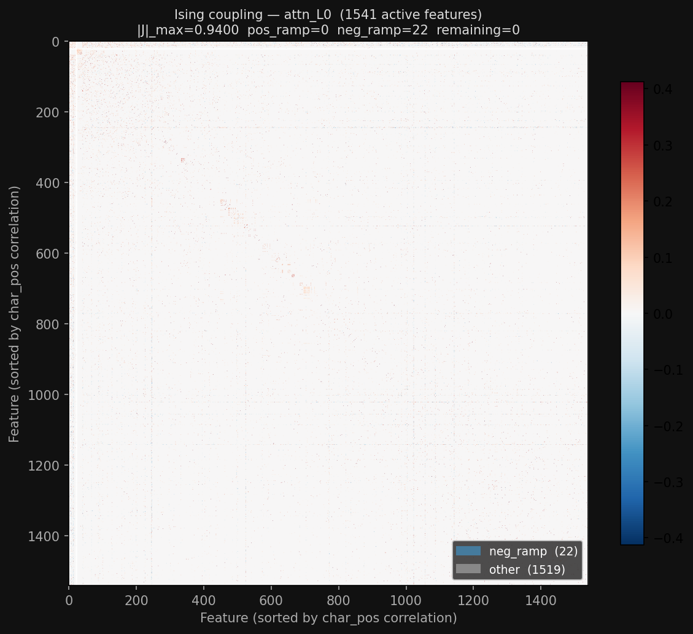
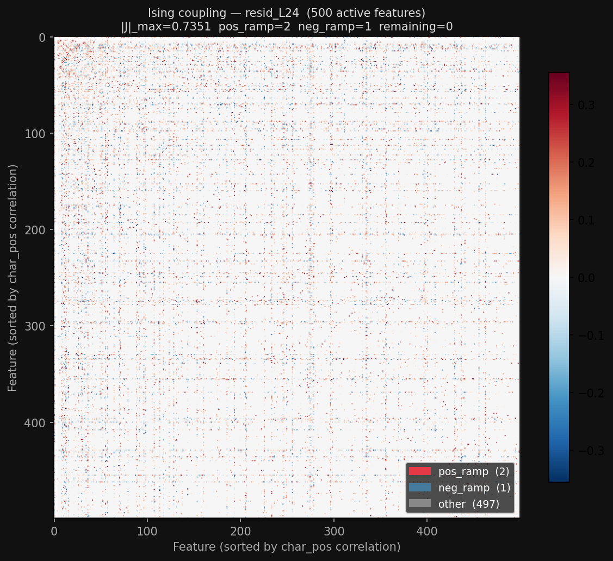

# Do Sparse Autoencoders Capture Concept Manifolds? — A Replication and Extension

## TLDR (for the author)

- **Synthetic replication**: Confirmed the three-regime structure (shattering → capture → dilution) with a TopK MSE SAE sweep ($k=3$–$25$). Peak restricted R²=0.82 at $k=14$. Ising at $k=4$ (capture sweet-spot) gives |J|_max=0.86 with clean block-diagonal structure after sorting atoms by ground-truth manifold; at $k=25$ (dilution) |J|_max≈0.025 — essentially noise.
- **Gemma 3 12B replication**: Colors, days, temperature, and years all recover expected manifold geometries (paraboloid, circle, line, helix) at layer 24 using zero-padded RGB prompts. 16k GemmaScope JumpReLU SAE captures all four manifolds with non-monotone R² curves (consistent with your Fig. 4A/4C). Ising restricted to 104 concept atoms shows block structure.
- **New finding — BPE tokenization artifact**: Hex `#rrggbb` tokenizes into 4–7 tokens depending on byte values, producing 4 discrete PCA clusters (one per token-count class). Zero-padded `rgb(rrr,ggg,bbb)` always produces exactly 17 tokens → smooth continuous manifold. Also: Gemma doesn't spontaneously encode years as a helix — month-injected prompts (`"The date is {month} {year}"`) are required.
- **Extension — line-breaking mechanistic interp**: Found F14066 as a binary near-break detector (mean_40=337, mean_80=0 in GemmaScope resid L24), F632 as a clean monotone position-ramp feature (r²=0.82 with char_pos at attn L1). Layer probe shows R²>0.97 with char_pos from layer 1, primarily written by attention (R²=0.856 at L0).

---

## Part 1: Background — Manifold Superposition and How SAEs Handle It

- Key idea: representations are *additive mixtures of manifold samples*, not just superposed directions.
  - Data model: $x = \sum_{i \in S} \tilde\gamma_i(\theta_i) V_i + \epsilon$, where each $\gamma_i$ is a point on a manifold, $V_i$ is its embedding matrix, $|S|$ is the number of active manifolds per sample.
- SAEs can capture manifolds in two ways:
  - **Globally**: a compact group of atoms whose linear span contains the entire manifold
  - **Locally (tiling)**: atoms that each selectively tile a restricted region of the geometry
- Three regimes as sparsity budget $k$ increases:
  1. **Shattering** (low $k$): atoms are shared across manifolds, small support, narrow RF
  2. **Capture** (intermediate $k$): atoms cleanly span individual manifold subspaces
  3. **Dilution** (high $k$): atoms over-tile manifolds redundantly; large support, wide RF
- The Ising model formalism: fit a pairwise Markov random field (±1 spins) to SAE atom co-firing patterns. Block-diagonal structure in the coupling matrix $J$ reveals manifold communities.

---

## Part 2: Synthetic Experiment — Setup

- 48 manifold instances: 8 types (circles, spheres, tori, Möbius strips, Swiss rolls, helices, flat disks, line segments) × 6 variants each
- Ambient dimension $d=128$, dictionary size $c=512$ (4× expansion)
- 2M training samples, 100k eval samples, $L_0=4$ manifolds active per sample
- TopK SAE, MSE reconstruction loss, Adam (lr=3e-3), cosine LR, auxiliary dead-neuron loss
- Sparsity sweep: $k \in \{3, 4, 6, 8, 10, 14, 16, 20, 25\}$

---

## Part 3: Synthetic Results — The Three Regimes

### Figure 4A: R² vs. sparsity

Left: aggregate mean R²@k_i peaks at k=14 (R²=0.82). Right: per-type subplots showing R²(# atoms) for five K values — low-k curves saturate early and cleanly; high-k curves are noisier and require more atoms before plateau.

### Figure 4B: Support size vs. RF spread path

Single averaged path from shattering (small support ≈3, narrow RF ≈0.52 at k=3) through capture (k=4–6) to dilution (support ≈43, RF ≈0.96 at k=25). The path traces the expected L-shape.

### Figure 4C: Ising coupling at k=4

155 active atoms sorted by ground-truth manifold assignment. Each manifold instance's 3–4 atoms form tight positive-coupling blocks; cross-manifold entries are near zero. |J|_max=0.86. (At k=25: |J|_max≈0.025 — dilution kills pairwise structure.)

### Results table

| k | R²@k_i | Support | RF spread | Regime |
|---|---|---|---|---|
| 3 | 0.515 | 3.3 | 0.52 | Shattering |
| 4 | 0.632 | 3.2 | 0.59 | Capture onset |
| 6 | 0.700 | 3.7 | 0.66 | — |
| 8 | 0.778 | 4.7 | 0.71 | — |
| 10 | 0.819 | 5.8 | 0.79 | — |
| **14** | **0.824** | **9.4** | **0.83** | **Peak** |
| 16 | 0.822 | 11.6 | 0.85 | Dilution onset |
| 20 | 0.819 | 21.4 | 0.94 | Dilution |
| 25 | 0.814 | 42.9 | 0.96 | Dilution |

Note: using MSE loss; paper uses L1. Peak shifts to k≈4 with L1 (see `checkpoints_l1/results.json`).

---

## Part 4: Extension to Gemma 3 12B

### Tokenization artifact and prompt engineering

Hex `#rrggbb` → 4–7 BPE tokens → 4 discrete PCA clusters (100% pure by token count). Fixed with zero-padded `rgb(rrr,ggg,bbb)` (always 17 tokens).

Zero-padded RGB (bottom-left) gives a smooth continuous paraboloid; hex variants all show discrete clusters.

Layer sweep (12/24/36/42): layer 42 shows most evenly distributed PCA variance (25.8/19.5/16.2%) and clearest hue curvature.

### Years: month-injection required

Paper's `"The date is {year}"` prompt doesn't produce a helix in Gemma; `"The date is {month} {year}"` injects periodic structure via months and recovers it.

### GemmaScope 16k SAE — restricted R²

Non-monotone R² curves consistent with paper's Fig. 4A. All four manifolds captured; temperature is near-linear (R² saturates quickly), colors requires most atoms.

Multi-n sweep (n=16/32/64/128 atom pools):

Curves collapse for k ≤ min(n) — top atoms are identical across pool sizes; larger pools improve maximum R² but not early behavior.

### GemmaScope 16k SAE — Figure 4B

Post-hoc top-K thresholding on JumpReLU codes. Colors has distinctly lower RF spread (≈0.57–0.78) vs. 1D manifolds (≈0.9–1.0), consistent with its 2D hue/saturation structure.

### GemmaScope 16k SAE — Ising coupling

Restricted to 104 concept atoms (union of per-manifold greedy selections): years=25, colors=30, temperature=25, days=24. Block structure visible across all four manifolds.

---

## Part 5: Extension — Line-Breaking Mechanistic Interpretability

Using Gemma 3 12B on a fixed-width line-breaking task (arXiv:2601.04480).

**Behavioral eval**: p(newline) is 3–424× higher than p(next word) mid-line; nl_margin ramps sharply at 75–85% of target width.

**SAE contrastive (resid L24)**: F14066 is a binary near-break detector (mean_40=337, mean_80=0); F885 is the largest-delta feature overall.

**Layer probe**: R²>0.97 with char_pos from layer 1 onward, declining to ~0.73 at final layer; attention is the primary position writer (R²=0.856 at L0, 0.995 at L1).

**Attn SAE position features**: GemmaScope `attn_out_all` 16k-small SAE at L1, F632: r=+0.905, r²=0.82 with char_pos — clean monotone ramp.

**Ising on attn SAEs**: Fit on prose-text codes for attn_out L0/L1 and resid_post L24; community structure visible but sparse concept labeling (content noise swamps position signal at R_THRESH=0.35 — needs re-run with control sequences).

---

## Part 6: Key Bugs for Replicators

- **Affine OLS is essential**: Using `codes @ decoder_cols.T` directly gives R²≈0.45; affine least-squares (codes → concept activations) gives R²≈0.82. The paper implies it but doesn't emphasize it.
- **L1 vs. MSE loss**: L1 peaks at lower k (≈4) matching the paper; MSE peaks later (≈14). If you're getting the wrong k for the capture regime, check your loss function.
- **Ising binarization**: Must use ±1 spins (sign of activation), not 0/1. Joint pseudo-likelihood with Adam + proximal L1 on GPU (~35s); L-BFGS doesn't work with L1.
- **Dead neurons**: 318/512 dead at k=4 without mitigation. Fix: auxiliary loss pushing dead neuron pre-activations toward TopK threshold + EMA firing rate tracking.
- **Gemma BPE artifact**: Hex color prompts → discrete PCA clusters. Use zero-padded RGB.
- **GemmaScope checkpoint keys**: Released weights use lowercase (`w_enc`, `w_dec`); naive loader expects uppercase. Remap before `load_state_dict`.
- **Gemma dtype**: float16 overflows on 12B intermediates → NaN. Use bfloat16.

---

## Appendix: Experimental Details

- **Hardware**: GPU server (cuda) for all runs
- **Synthetic**: ~full sweep took ~several hours; checkpoints at `checkpoints_mse/sae_k*.pt`
- **GemmaScope SAEs**: `google/gemma-scope-2-12b-it`, layer 24, resid_post, 16k width, medium L0≈44.7
- **Scripts**: `run_synthetic.py`, `run_synthetic_ising.py`, `plot_synthetic_fig4.py`, `run_gemma_eval.py`, `run_gemma_linebreak_eval.py`, `run_gemma_linebreak_mech.py`
